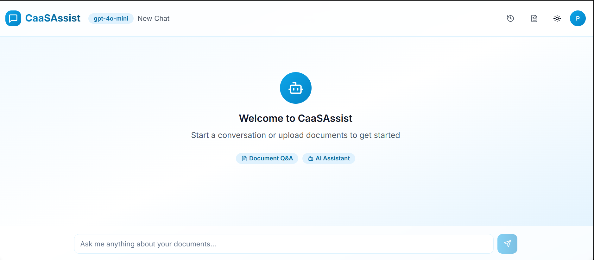
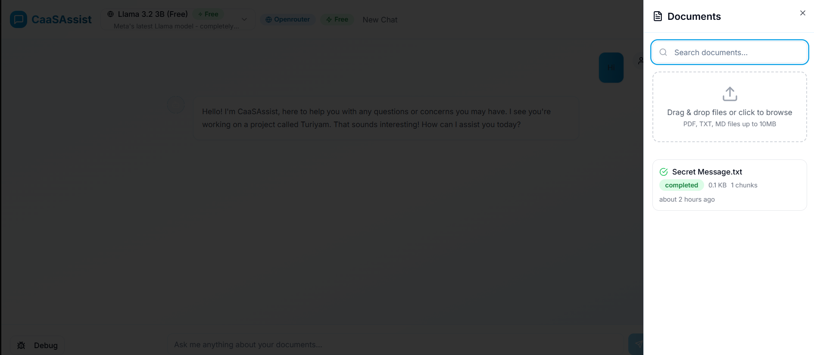
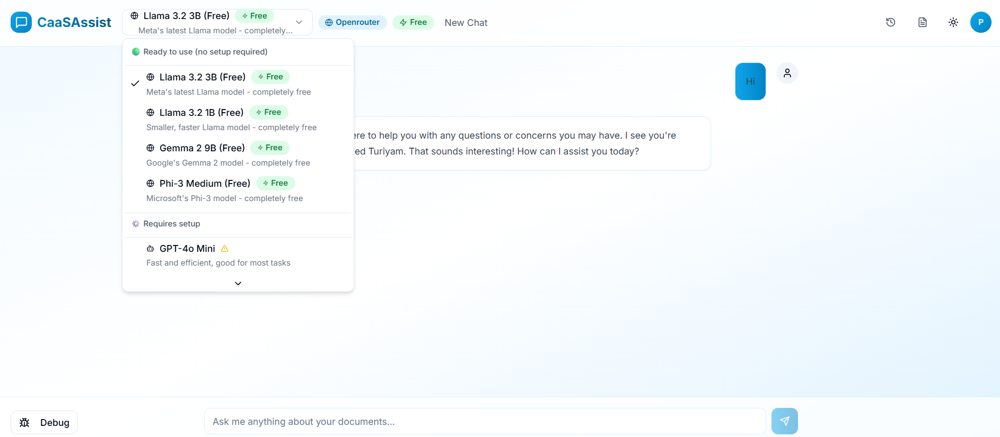
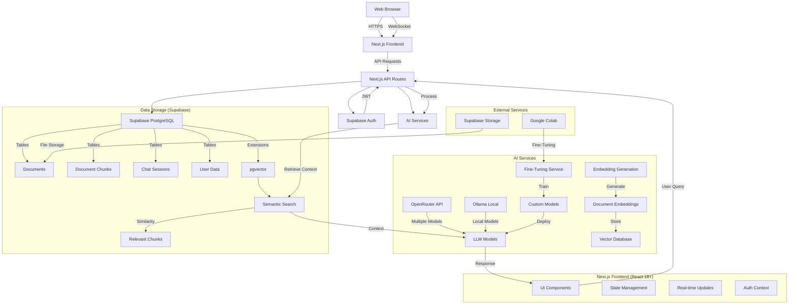

<div align="center">
  <h1>🤖 CaaSAssist - Conversational Agent as a Service</h1>
  <p>A production-grade, multi-tenant SaaS platform that enables seamless document-based AI conversations through Retrieval-Augmented Generation (RAG) technology and additional primitive Fine-Tuning capabilities.</p>
  
  <p align="center">
    <a href="https://github.com/PriyankaAnantha/caasassist-platform">
      
      
      
    </a>
    <a href="LICENSE">
      
    </a>
    <a href="https://nextjs.org/">
      
    </a>
  </p>
  
  <p align="center">
    <a href="#features">Features</a> •
    <a href="#tech-stack">Tech Stack</a> •
    <a href="#architecture">Architecture</a> •
    <a href="#fine-tuning">Fine-Tuning</a> •
    <a href="#getting-started">Getting Started</a> •
    <a href="#deployment">Deployment</a> •
    <a href="#contributing">Contributing</a>
  </p>


  <div style="display: flex; flex-direction: column; align-items: center; gap: 20px; margin: 20px 0;">
    
    
    
    
  </div>

  <h3>🔐 Test User Credentials</h3>
  <p>Feel free to use these test credentials to explore the platform:</p>
  <p><strong>Email:</strong> procodergo@gmail.com<br><strong>Password:</strong> 1****6</p>
</div>

## ✨ Key Features

### Core Capabilities
- **Document Processing & Management**
  - Upload and process PDF, TXT, and MD documents
  - Automatic text extraction and chunking (1000 characters per chunk with 200-character overlap)
  - Document status tracking (uploading, processing, completed, error)
  - Secure file storage with Supabase Storage

- **Vector Search & Embeddings**
  - Generate embeddings using Ollama with Nomic Embed Text
  - Store and query vector embeddings using pgvector
  - Semantic search across document chunks
  - Configurable similarity thresholds for search results

- **Multi-Model Chat Interface**
  - Support for multiple AI providers (OpenAI, OpenRouter, Ollama)
  - Real-time response streaming for natural conversations
  - Context-aware responses using RAG (Retrieval-Augmented Generation)
  - Conversation history and session management

- **Model Integration**
 - OpenRouter integration for accessing various models
  - Configurable support for GPT-4o Mini and other OpenAI models
  - Local Ollama server support for offline/private model hosting
  - Dynamic model switching and configuration

- **User Authentication & Data Security**
  - Secure authentication with Supabase Auth
  - Row-Level Security (RLS) for data isolation
  - JWT-based session management
  - Protected API routes with middleware validation

### Fine-Tuning Capabilities
- **Model Training**
  - Fine-tune various open-source LLMs including Llama 3.2, Mistral, and Gemma
  - Support for QLoRA (Quantized Low-Rank Adaptation) for efficient fine-tuning
  - Custom training on user-provided documents (PDF, TXT, MD formats)
  - Background job processing with real-time progress tracking

- **Training Features**
  - Automatic dataset preparation and formatting
  - Configurable training parameters (learning rate, batch size, epochs)
  - Integration with Google Colab for GPU-accelerated training
  - Model checkpointing and resumable training

- **Model Management**
  - Download and save fine-tuned models
  - Interactive chat interface for model testing
  - Support for multiple model versions
  - Secure storage of training artifacts

### Technical Highlights
- **Multi-Model Support**  
  - OpenRouter (various models)
  - Configurable OpenAI (GPT-4o Mini, GPT-3.5-turbo)
  - Local Ollama with Nomic Embed Text
  - Dynamic model switching via API

- **Developer Experience**
  - TypeScript with Next.js 13+
  - App Router architecture
  - Shadcn UI components
  - Zustand for state management

- **Performance & Scalability**
  - Server-side rendering (SSR)
  - Vector search with pgvector
  - Batch processing for document chunks
  - Real-time response streaming

## 🛠 Tech Stack

### Frontend
<div style="display: flex; flex-wrap: wrap; gap: 8px; margin: 12px 0 20px 0;">
  <a href="https://nextjs.org/" target="_blank">
    
  </a>
  <a href="https://react.dev/" target="_blank">
    
  </a>
  <a href="https://www.typescriptlang.org/" target="_blank">
    
  </a>
  <a href="https://tailwindcss.com/" target="_blank">
    
  </a>
  <a href="https://ui.shadcn.com/" target="_blank">
    
  </a>
  <a href="https://zustand-demo.pmnd.rs/" target="_blank">
    
  </a>
  <a href="https://www.npmjs.com/package/ai" target="_blank">
    
  </a>
  <a href="https://supabase.com/" target="_blank">
    
  </a>
  <a href="https://react-hook-form.com/" target="_blank">
    
  </a>
  <a href="https://zod.dev/" target="_blank">
    
  </a>
</div>

### Backend
<div style="display: flex; flex-wrap: wrap; gap: 10px; margin: 10px 0;">
  <a href="https://nextjs.org/docs/app" target="_blank">
    
  </a>
  <a href="https://supabase.com/docs/guides/auth" target="_blank">
    
  </a>
  <a href="https://supabase.com/docs/guides/database" target="_blank">
    
  </a>
  <a href="https://github.com/pgvector/pgvector" target="_blank">
    
  </a>
  <a href="https://supabase.com/docs/guides/storage" target="_blank">
    
  </a>
</div>

### AI & Data Processing
<div style="display: flex; flex-wrap: wrap; gap: 10px; margin: 10px 0;">
  <a href="https://www.npmjs.com/package/ai" target="_blank">
    
  </a>
  <a href="https://openai.com/" target="_blank">
    
  </a>
  <a href="https://openrouter.ai/" target="_blank">
    
  </a>
  <a href="https://ollama.ai/" target="_blank">
    
  </a>
  <a href="https://huggingface.co/nomic-ai" target="_blank">
    
  </a>
</div>


## 📁 Project Structure

```
caasassist-platform/
├── app/                      # Next.js app directory
│   ├── api/                  # API routes
│   ├── chat/                 # Chat interface components
│   ├── fine-tuning/          # Model fine-tuning interface
│   └── ...
├── components/               # Reusable UI components
├── hooks/                    # Custom React hooks
├── lib/                      # Shared utilities and libraries
├── public/                   # Static assets
├── scripts/                  # Utility scripts
├── styles/                   # Global styles
├── supabase/                 # Supabase configuration and migrations
├── unsloth_api_colab/        # Unsloth API integration for Colab
├── .env.local                # Environment variables
├── next.config.mjs           # Next.js configuration
├── package.json              # Project dependencies
└── tsconfig.json             # TypeScript configuration
```

## 🏗️ System Architecture

CaaSAssist is built on a modern, full-stack architecture that leverages Next.js for both frontend and backend, with Supabase for data persistence and authentication. The system is designed to be scalable, secure, and maintainable.

### Architecture Overview



### Data Flow

1. **User Authentication**
   - Users authenticate via Supabase Auth
   - JWT tokens are used for subsequent API requests
   - Row Level Security (RLS) ensures data isolation

2. **Document Processing**
   ```
   User Upload → File Validation → Text Extraction → 
   Chunking → Embedding Generation → Vector Storage
   ```
   - Supports PDF, TXT, and MD formats
   - Documents are split into chunks with overlap
   - Each chunk is converted to embeddings using Ollama/Nomic Embed Text
   - Chunks and embeddings are stored in Supabase with pgvector

3. **Chat Interaction**
   ```
   User Query → Embedding Generation → 
   Vector Similarity Search → Context Augmentation → 
   LLM Generation → Response Streaming
   ```
   - User queries are converted to embeddings
   - Relevant document chunks are retrieved using vector similarity
   - Context is augmented with conversation history
   - Response is streamed in real-time

4. **Model Fine-Tuning**
   - Users can fine-tune models via Google Colab integration
   - Training data is processed and sent to Unsloth backend
   - Fine-tuned models are stored and can be deployed

### Key Components

1. **Frontend (Next.js 13+)**
   - App Router for file-based routing
   - Server Components for better performance
   - Client-side state management with Zustand
   - Real-time updates via Server-Sent Events

2. **Backend (Next.js API Routes)**
   - RESTful API endpoints
   - Authentication middleware
   - Rate limiting and request validation
   - Error handling and logging

3. **Database (Supabase PostgreSQL)**
   - User authentication and profiles
   - Document and chunk storage
   - Vector embeddings with pgvector
   - Chat history and sessions

4. **AI Services**
   - Multiple model providers (OpenRouter, Ollama, configurable OpenAI)
   - Embedding generation with Nomic Embed Text
   - RAG (Retrieval-Augmented Generation)
   - Model fine-tuning capabilities

### Security Considerations

- Row Level Security (RLS) for data isolation
- JWT-based authentication
- Secure file uploads with signed URLs
- Environment-based configuration
- Rate limiting on API endpoints

### Components

1. **Frontend**
   - Next.js 13+ with App Router
   - React Server Components
   - Tailwind CSS + Shadcn UI
   - Real-time updates with Server-Sent Events

2. **Backend**
   - Next.js API Routes
   - Supabase for authentication and database
   - Vector embeddings with pgvector (via Supabase)
   - File storage with Supabase Storage

3. **AI Services**
   - **Embedding Generation**: Local Ollama server with Nomic Embed Text model
   - **LLM Integration**: OpenRouter API for model access
   - **RAG Pipeline**:
     - Document chunking and embedding
     - Vector similarity search using pgvector
     - Context-aware response generation
   - **Fine-Tuning**: Custom model training via Google Colab

### Embedding System

CaaSAssist uses a local Ollama server with the Nomic Embed Text model for generating embeddings. This provides:

- **Local Processing**: All embeddings are generated on your infrastructure
- **Cost-Effective**: No API costs for embedding generation
- **Privacy-First**: Your data never leaves your infrastructure
- **Fallback Mechanism**: Simple TF-IDF (Term Frequency-Inverse Document Frequency is a simple but effective fallback method for text search and information retrieval when vector embeddings aren't available) based fallback if Ollama is unavailable

#### Setup Requirements

1. **Ollama Server**:
   ```bash
   # Install Ollama (if not already installed)
   # See: https://ollama.ai/
   
   # Start the Ollama server
   ollama serve
   
   # Pull the Nomic Embed Text model
   ollama pull nomic-embed-text
   ```

2. **Environment Variables**:
   ```env
   # In your .env.local
   OLLAMA_API_URL=http://localhost:11434
   EMBEDDING_MODEL=nomic-embed-text
   ```

## 🎯 Fine-Tuning Capabilities

CaaSAssist provides a streamlined workflow for fine-tuning language models using Google Colab's free GPU resources. The fine-tuning process is handled through a client-server architecture:

### Supported Models
- `unsloth/Llama-3.2-1B-Instruct`
- `unsloth/tinyllama-bnb-4bit`
- `unsloth/mistral-7b-v0.3-bnb-4bit`
- `unsloth/gemma-2-9b-it-bnb-4bit`

### How It Works

1. **Backend (Google Colab)**
   - Runs a FastAPI server with access to NVIDIA T4 GPU
   - Uses ngrok to create a secure public URL
   - Handles the heavy computation of model training

2. **Client (Local Machine)**
   - Interactive command-line interface
   - Handles file uploads and job monitoring
   - Downloads the final model after training

### Getting Started with Fine-Tuning

1. **Set Up ngrok**
   - Sign up at [ngrok.com](https://ngrok.com)
   - Get your authtoken from the dashboard

2. **Run the Backend on Colab**
   - Open `unsloth_api_colab/backend_colab_pro.py` in Google Colab
   - Set up a GPU runtime
   - Add your ngrok authtoken
   - Start the API server

3. **Use the Interactive Client**
   ```bash
   python unsloth_api_colab/test_client_interactive.py
   ```
   - Follow the prompts to upload documents and start training
   - The client will guide you through the entire process

### Key Features
- **Document Support**: Process PDF, TXT, and MD files
- **Interactive Training**: Monitor progress through the command line
- **Model Testing**: Chat with your fine-tuned model directly after training

For detailed instructions, see the [Fine-Tuning Guide](./unsloth_api_colab/README.md).

## 🚀 Getting Started

### Prerequisites

- **Development Environment**:
  - Node.js 18+ and npm
  - PostgreSQL 14+
  - Python 3.8+ (for fine-tuning)
  - Ollama (for local embeddings)

- **Services**:
  - Supabase account (database and auth)
  - OpenRouter API key (for LLM access)
  - Google account (for Colab fine-tuning)

- **Local Setup**:
  - Ollama server running with Nomic Embed Text model
  - Required environment variables configured

### System Requirements

- RAM: 8GB+ (16GB recommended for local AI models)
- Disk Space: 2GB+ free space
- Internet connection for API dependencies

## 🚀 Quick Start

### 1. Clone the Repository

```bash
git clone https://github.com/PriyankaAnantha/caasassist-platform.git

cd caasassist-platform
```

### 2. Install Dependencies

```bash
npm install
```

### 3. Set Up Supabase

1. **Create a new Supabase project** at [supabase.com](https://supabase.com)

2. **Set up the database schema**:
   - Go to SQL Editor in your Supabase dashboard
   - Copy and paste the contents of `supabase/schema.sql`
   - Click "Run" to execute the schema

3. **Set up storage**:
   - Go to SQL Editor again
   - Copy and paste the contents of `supabase/storage-simple-fix.sql`
   - Click "Run" to create the documents bucket and policies

4. **Enable pgvector extension**:
   - Go to Database > Extensions
   - Search for "vector" 
   - Enable the `vector` extension

5. **Get your credentials**:
   - Go to Settings > API
   - Copy your Project URL and anon/public key

### 4. Configure Environment Variables

Create a `.env.local` file in the root directory:

```env
# Supabase Configuration (Required)
NEXT_PUBLIC_SUPABASE_URL=your_supabase_project_url
NEXT_PUBLIC_SUPABASE_ANON_KEY=your_supabase_anon_key

# AI Provider Keys (Choose one or more)

# OpenAI (Premium models)
OPENAI_API_KEY=your_openai_api_key

# OpenRouter (Free models - RECOMMENDED for getting started)
OPENROUTER_API_KEY=your_openrouter_api_key

# Ollama (Local models)
OLLAMA_BASE_URL=http://localhost:11434/v1

# Site URL (for OpenRouter)
NEXT_PUBLIC_SITE_URL=http://localhost:3000

```

### 5. Get Free AI Access (Recommended)

**Option A: OpenRouter (Free Models)**
1. Visit [openrouter.ai](https://openrouter.ai/)
2. Sign up for a free account
3. Go to Keys section and create a new API key
4. Add it to your `.env.local` as `OPENROUTER_API_KEY`

**Option B: Local Ollama (Completely Free)**
1. Install Ollama: `curl -fsSL https://ollama.ai/install.sh | sh`
2. Start Ollama: `ollama serve`
3. Pull a model: `ollama pull llama3.2:3b`

**Option C: OpenAI (Premium)**
1. Get an API key from [OpenAI](https://platform.openai.com/)
2. Add it to your `.env.local` as `OPENAI_API_KEY`

### 6. Run the Development Server

```
npm run dev

```

Open [http://localhost:3000](http://localhost:3000) in your browser.

## 🔧 Model Fine-Tuning Guide

### Accessing the Fine-Tuning Interface
1. Log in to your CaaSAssist account
2. Click on the "Fine-tune" button in the top navigation bar
3. You'll be redirected to the fine-tuning dashboard

### Creating a New Fine-Tuning Job
1. **Configure Model**
   - Enter a unique name for your fine-tuned model
   - Select a base model from the available options
   - Adjust training parameters (epochs, learning rate, etc.)

2. **Upload Training Data**
   - Click "Upload Files" and select your training data in JSONL format
   - Each line should be a JSON object with "prompt" and "completion" fields
   - You can upload multiple files (up to 10 files per job)

3. **Start Training**
   - Review your configuration
   - Click "Start Fine-tuning" to begin the training process
   - Monitor progress in real-time

### Managing Fine-Tuned Models
- View all your fine-tuned models in the "My Models" section
- Track training progress and metrics
- Deploy fine-tuned models directly to the chat interface
- Delete models when no longer needed

### Best Practices
- Start with a small subset of your data for testing
- Use a learning rate between 2e-5 and 2e-4 for most use cases
- Monitor loss values to detect overfitting
- Save checkpoints to resume training if needed

### Supported Base Models
- `unsloth/llama-3-8b-bnb-4bit` (Recommended for most use cases)
- `unsloth/llama-3-8b`
- `unsloth/mistral-7b`
- `unsloth/gemma-7b`

## 🤖 AI Models Status

### ✅ Working Models (Tested & Confirmed)

**OpenRouter Free Models (No setup required)**
- `meta-llama/llama-3.2-3b-instruct:free` - **RECOMMENDED** ⭐
- `meta-llama/llama-3.2-1b-instruct:free` - Fast and lightweight
- `google/gemma-2-9b-it:free` - Google's Gemma model

**OpenAI Models (Requires API key)**
- `gpt-4o-mini` - Fast and efficient
- `gpt-4o` - Most capable
- `gpt-3.5-turbo` - Cost-effective

**Ollama Local Models (Requires Ollama setup)**
- `llama3.2:3b` - Local Llama 3.2 3B
- `llama3.2:1b` - Local Llama 3.2 1B  
- `llama3.1:8b` - Local Llama 3.1 8B
- `mistral:7b` - Local Mistral 7B
- `codellama:7b` - Local Code Llama
- `qwen2.5:7b` - Local Qwen 2.5

### ❌ Known Issues

**OpenRouter Models with Problems**
- `microsoft/phi-3-*` models - Currently experiencing API errors
- Some larger free models may be rate-limited or unstable

## 📁 Project Structure

```
caasassist-platform/
├── app/                    # Next.js app directory
│   ├── api/               # API routes
│   ├── chat/              # Chat page
│   ├── globals.css        # Global styles
│   ├── layout.tsx         # Root layout
│   └── page.tsx           # Landing page
├── components/            # React components
│   ├── ui/               # ShadCN UI components
│   ├── auth-modal.tsx    # Authentication modal
│   ├── chat-interface.tsx # Main chat interface
│   ├── chat-header.tsx   # Chat header
│   ├── chat-history.tsx  # Chat history sidebar
│   ├── document-manager.tsx # Document management
│   ├── model-selector.tsx # AI model selector
│   └── landing-page.tsx  # Landing page
├── lib/                  # Utility libraries
│   ├── stores/          # Zustand stores
│   ├── supabase/        # Supabase client configuration
│   └── utils.ts         # Utility functions
├── supabase/            # Database schema and migrations
└── README.md
```

## 🔧 Configuration

### Supabase Setup

1. **Database Schema**: Run the SQL schema from `supabase/schema.sql`
2. **Row Level Security**: Policies are automatically created for data isolation
3. **Storage**: Configure the `documents` bucket for file uploads
4. **Extensions**: Enable `pgvector` for vector similarity search

### Environment Variables

| Variable | Description | Required |
|----------|-------------|----------|
| `NEXT_PUBLIC_SUPABASE_URL` | Your Supabase project URL | Yes |
| `NEXT_PUBLIC_SUPABASE_ANON_KEY` | Your Supabase anonymous key | Yes |
| `OPENAI_API_KEY` | OpenAI API key for premium models | Optional |
| `OPENROUTER_API_KEY` | OpenRouter API key for free models | Optional |
| `OLLAMA_BASE_URL` | Ollama server URL for local models | Optional |
| `NEXT_PUBLIC_SITE_URL` | Your site URL (for OpenRouter) | Optional |

## 🚀 Deployment

### Frontend (Vercel)

1. Connect your repository to Vercel
2. Set environment variables in Vercel dashboard
3. Deploy automatically on push to main branch

### Database (Supabase)

- Supabase is already hosted and managed
- Ensure your production environment variables are set correctly

### File Storage

- Supabase Storage handles file uploads and management
- Configure appropriate bucket policies for production

## 📚 Usage

### 1. Authentication
- Sign up for a new account or sign in
- User profiles are automatically created

### 2. Choose Your AI Model
- **For beginners**: Use OpenRouter free models (no setup required)
- **For local use**: Set up Ollama for completely free local models
- **For premium**: Configure OpenAI API key for best performance

### 3. Document Management
- Click the document icon to open the document manager
- Drag and drop files or click to browse
- Supported formats: PDF, TXT, MD (up to 10MB)
- Documents are automatically processed and chunked

### 4. Chat Interface
- Start a new conversation or continue existing ones
- Ask questions about your uploaded documents
- AI responses are streamed in real-time
- Chat history is automatically saved

### 5. Session Management
- View all chat sessions in the history sidebar
- Rename or delete sessions as needed
- Search through conversation history

## 🔒 Security Features

- **Row Level Security**: Database-level access control
- **Authentication**: Secure user authentication via Supabase Auth
- **File Validation**: Type and size validation for uploads
- **API Protection**: All API routes require authentication
- **Data Isolation**: Users can only access their own data

## 🎨 Customization

### Theme Configuration
- Light/dark theme support via `next-themes`
- Customizable color palette in `tailwind.config.ts`
- Glassmorphism effects for modern UI

### AI Models
- Configurable model selection
- Support for multiple AI providers via AI SDK
- Easy to extend with new models

## 🐛 Troubleshooting

### Common Issues

1. **Supabase Connection Issues**
   - Verify environment variables are correct
   - Check if pgvector extension is enabled
   - Ensure RLS policies are properly configured

2. **File Upload Issues**
   - Check Supabase Storage bucket configuration
   - Verify file size and type restrictions
   - Ensure proper authentication

3. **AI Model Issues**
   - **Phi-3 models not working**: Use Llama 3.2 or Gemma models instead
   - **OpenRouter errors**: Check your API key and try different models
   - **Ollama connection failed**: Ensure Ollama is running with `ollama serve`

4. **Chat Streaming Issues**
   - Verify API keys are valid
   - Check network connectivity
   - Monitor browser console for errors

### Model-Specific Troubleshooting

**OpenRouter Free Models**
- If a model fails, try switching to `meta-llama/llama-3.2-3b-instruct:free`
- Some models may be temporarily unavailable
- Rate limits may apply during peak usage

**Ollama Local Models**
- Ensure Ollama is installed and running: `ollama serve`
- Check if the model is installed: `ollama list`
- Pull missing models: `ollama pull llama3.2:3b`

**OpenAI Models**
- Verify API key is valid and has credits
- Check quota limits in OpenAI dashboard
- Monitor rate limits

## 📈 Performance Optimization

- **Vector Search**: Optimized with pgvector indexes
- **Chunking Strategy**: Configurable chunk size and overlap
- **Caching**: Client-side state management with Zustand
- **Streaming**: Real-time response streaming for better UX

## 🤝 Contributing

1. Fork the repository
2. Create a feature branch
3. Make your changes
4. Add tests if applicable
5. Submit a pull request

## 📬 Contact

For any questions or feedback, please feel free to reach out:

- [Email](mailto:priyankaananthashetty@gmail.com)
- [LinkedIn](https://www.linkedin.com/in/priyanka-anantha/)
- [GitHub Issues](https://github.com/PriyankaAnantha/caasassist-platform/issues)

## 🤝 Contributing

We welcome contributions from the community! Here's how you can help:

1. **Report Bugs**: File an issue if you find any bugs or have suggestions
2. **Submit Pull Requests**: Help fix issues or add new features
3. **Improve Documentation**: Help improve our documentation
4. **Share Feedback**: Let us know how we can improve


## 📄 License

This project is licensed under the MIT License - see the [LICENSE](LICENSE) file for details.

## 🙌 Acknowledgments

- Built with ❤️ by [Priyanka A](https://github.com/PriyankaAnantha)
- Thanks to mentor [Ma'am Sharmila Sudhakar](https://github.com/sharmilasudhakar07) who has helped shape this project
- Special thanks to the open-source community for the amazing tools and libraries


## 🌟 Show Your Support

If you find this project useful, please consider giving it a ⭐️ on [GitHub](https://github.com/PriyankaAnantha/caasassist-platform).

## 🔄 Recent Updates

### Fixed Issues
- ✅ Document reading now works correctly with enhanced search
- ✅ Session deletion properly removes messages and sessions
- ✅ Model selector shows working status for each model
- ✅ Ollama integration with proper connection testing
- ✅ Better error handling for problematic models

### Known Working Models
- **OpenRouter**: Llama 3.2 (3B/1B), Gemma 2 9B
- **OpenAI**: All models (with valid API key)
- **Ollama**: All models (when properly installed)

---

<div align="center">
  <p>Built with ❤️ by <a href="https://github.com/PriyankaAnantha" target="_blank">Priyanka A</a></p>
  <p>
    <a href="https://github.com/PriyankaAnantha/caasassist-platform" target="_blank">
      
    </a>
    <a href="https://github.com/PriyankaAnantha/caasassist-platform/fork" target="_blank">
      
    </a>
    <a href="https://github.com/PriyankaAnantha/caasassist-platform/issues" target="_blank">
      
    </a>
  </p>
  <p>
    <a href="https://github.com/PriyankaAnantha/caasassist-platform/blob/main/LICENSE" target="_blank">
      
    </a>
  </p>
</div>
