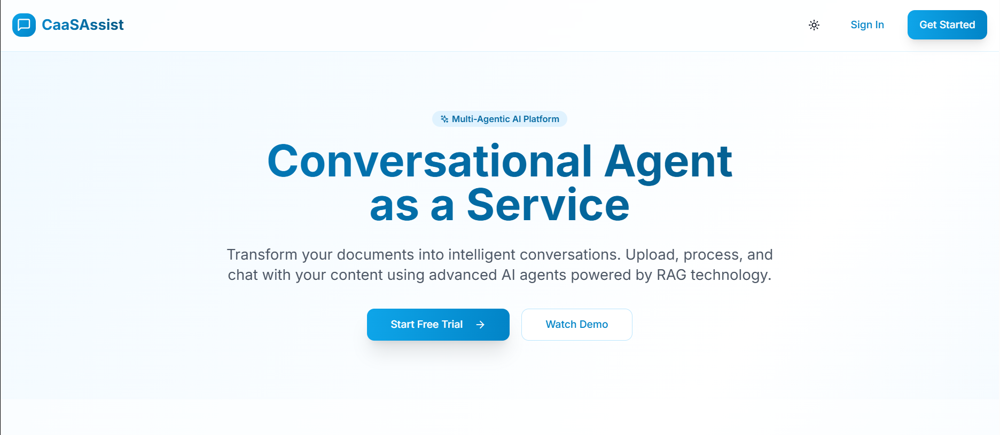

# CaaSAssist - Conversational Agent as a Service

A cutting-edge, multi-tenant SaaS platform that enables users to upload documents, configure AI chat agents, and engage in intelligent conversations powered by RAG (Retrieval-Augmented Generation) technology.



## 🚀 Features

- **Multi-Tenant Architecture**: Secure, isolated user environments
- **Document Processing**: Upload and process PDFs, text files with automatic chunking and vectorization
- **RAG-Powered Chat**: Intelligent conversations with context from your documents
- **Multiple AI Providers**: OpenAI, OpenRouter (free models), and local Ollama support
- **Real-time Streaming**: Live AI responses with streaming capabilities
- **Chat History**: Persistent conversation management with search and organization
- **Modern UI**: Clean, professional interface with light/dark theme support

## 🛠 Tech Stack

### Frontend
- **Next.js 15** (App Router)
- **React 19** with TypeScript
- **Tailwind CSS** for styling
- **ShadCN/UI** component library
- **Zustand** for state management
- **Framer Motion** for animations

### Backend
- **Next.js API Routes** (RESTful APIs)
- **Server-Sent Events** for chat streaming
- **AI SDK** for LLM integration

### Database & Services
- **Supabase** (PostgreSQL with pgvector)
- **Supabase Auth** for authentication
- **Supabase Storage** for file storage

### AI Providers
- **OpenAI** (GPT-4o, GPT-4o-mini, GPT-3.5-turbo) - requires API key
- **OpenRouter** (free models: Llama 3.2, Gemma 2) - requires free API key
- **Ollama** (local models) - free, runs locally

## 📋 Prerequisites

- Node.js 18+ 
- npm or yarn
- Supabase account
- AI provider API keys (optional for free models)

## 🚀 Quick Start

### 1. Clone the Repository

```bash
git clone <repository-url>
cd caasassist-platform
```

### 2. Install Dependencies

```bash
npm install
```

### 3. Set Up Supabase

1. **Create a new Supabase project** at [supabase.com](https://supabase.com)

2. **Set up the database schema**:
   - Go to SQL Editor in your Supabase dashboard
   - Copy and paste the contents of `supabase/schema.sql`
   - Click "Run" to execute the schema

3. **Set up storage**:
   - Go to SQL Editor again
   - Copy and paste the contents of `supabase/storage-simple-fix.sql`
   - Click "Run" to create the documents bucket and policies

4. **Enable pgvector extension**:
   - Go to Database > Extensions
   - Search for "vector" 
   - Enable the `vector` extension

5. **Get your credentials**:
   - Go to Settings > API
   - Copy your Project URL and anon/public key

### 4. Configure Environment Variables

Create a `.env.local` file in the root directory:

```env
# Supabase Configuration (Required)
NEXT_PUBLIC_SUPABASE_URL=your_supabase_project_url
NEXT_PUBLIC_SUPABASE_ANON_KEY=your_supabase_anon_key

# AI Provider Keys (Choose one or more)

# OpenAI (Premium models)
OPENAI_API_KEY=your_openai_api_key

# OpenRouter (Free models - RECOMMENDED for getting started)
OPENROUTER_API_KEY=your_openrouter_api_key

# Ollama (Local models)
OLLAMA_BASE_URL=http://localhost:11434/v1

# Site URL (for OpenRouter)
NEXT_PUBLIC_SITE_URL=http://localhost:3000

```

### 5. Get Free AI Access (Recommended)

**Option A: OpenRouter (Free Models)**
1. Visit [openrouter.ai](https://openrouter.ai/)
2. Sign up for a free account
3. Go to Keys section and create a new API key
4. Add it to your `.env.local` as `OPENROUTER_API_KEY`

**Option B: Local Ollama (Completely Free)**
1. Install Ollama: `curl -fsSL https://ollama.ai/install.sh | sh`
2. Start Ollama: `ollama serve`
3. Pull a model: `ollama pull llama3.2:3b`

**Option C: OpenAI (Premium)**
1. Get an API key from [OpenAI](https://platform.openai.com/)
2. Add it to your `.env.local` as `OPENAI_API_KEY`

### 6. Run the Development Server

```
npm run dev

```

Open [http://localhost:3000](http://localhost:3000) in your browser.

## 🤖 AI Models Status

### ✅ Working Models (Tested & Confirmed)

**OpenRouter Free Models (No setup required)**
- `meta-llama/llama-3.2-3b-instruct:free` - **RECOMMENDED** ⭐
- `meta-llama/llama-3.2-1b-instruct:free` - Fast and lightweight
- `google/gemma-2-9b-it:free` - Google's Gemma model

**OpenAI Models (Requires API key)**
- `gpt-4o-mini` - Fast and efficient
- `gpt-4o` - Most capable
- `gpt-3.5-turbo` - Cost-effective

**Ollama Local Models (Requires Ollama setup)**
- `llama3.2:3b` - Local Llama 3.2 3B
- `llama3.2:1b` - Local Llama 3.2 1B  
- `llama3.1:8b` - Local Llama 3.1 8B
- `mistral:7b` - Local Mistral 7B
- `codellama:7b` - Local Code Llama
- `qwen2.5:7b` - Local Qwen 2.5

### ❌ Known Issues

**OpenRouter Models with Problems**
- `microsoft/phi-3-*` models - Currently experiencing API errors
- Some larger free models may be rate-limited or unstable

## 📁 Project Structure

```
caasassist-platform/
├── app/                    # Next.js app directory
│   ├── api/               # API routes
│   ├── chat/              # Chat page
│   ├── globals.css        # Global styles
│   ├── layout.tsx         # Root layout
│   └── page.tsx           # Landing page
├── components/            # React components
│   ├── ui/               # ShadCN UI components
│   ├── auth-modal.tsx    # Authentication modal
│   ├── chat-interface.tsx # Main chat interface
│   ├── chat-header.tsx   # Chat header
│   ├── chat-history.tsx  # Chat history sidebar
│   ├── document-manager.tsx # Document management
│   ├── model-selector.tsx # AI model selector
│   └── landing-page.tsx  # Landing page
├── lib/                  # Utility libraries
│   ├── stores/          # Zustand stores
│   ├── supabase/        # Supabase client configuration
│   └── utils.ts         # Utility functions
├── supabase/            # Database schema and migrations
└── README.md
```

## 🔧 Configuration

### Supabase Setup

1. **Database Schema**: Run the SQL schema from `supabase/schema.sql`
2. **Row Level Security**: Policies are automatically created for data isolation
3. **Storage**: Configure the `documents` bucket for file uploads
4. **Extensions**: Enable `pgvector` for vector similarity search

### Environment Variables

| Variable | Description | Required |
|----------|-------------|----------|
| `NEXT_PUBLIC_SUPABASE_URL` | Your Supabase project URL | Yes |
| `NEXT_PUBLIC_SUPABASE_ANON_KEY` | Your Supabase anonymous key | Yes |
| `OPENAI_API_KEY` | OpenAI API key for premium models | Optional |
| `OPENROUTER_API_KEY` | OpenRouter API key for free models | Optional |
| `OLLAMA_BASE_URL` | Ollama server URL for local models | Optional |
| `NEXT_PUBLIC_SITE_URL` | Your site URL (for OpenRouter) | Optional |

## 🚀 Deployment

### Frontend (Vercel)

1. Connect your repository to Vercel
2. Set environment variables in Vercel dashboard
3. Deploy automatically on push to main branch

### Database (Supabase)

- Supabase is already hosted and managed
- Ensure your production environment variables are set correctly

### File Storage

- Supabase Storage handles file uploads and management
- Configure appropriate bucket policies for production

## 📚 Usage

### 1. Authentication
- Sign up for a new account or sign in
- User profiles are automatically created

### 2. Choose Your AI Model
- **For beginners**: Use OpenRouter free models (no setup required)
- **For local use**: Set up Ollama for completely free local models
- **For premium**: Configure OpenAI API key for best performance

### 3. Document Management
- Click the document icon to open the document manager
- Drag and drop files or click to browse
- Supported formats: PDF, TXT, MD (up to 10MB)
- Documents are automatically processed and chunked

### 4. Chat Interface
- Start a new conversation or continue existing ones
- Ask questions about your uploaded documents
- AI responses are streamed in real-time
- Chat history is automatically saved

### 5. Session Management
- View all chat sessions in the history sidebar
- Rename or delete sessions as needed
- Search through conversation history

## 🔒 Security Features

- **Row Level Security**: Database-level access control
- **Authentication**: Secure user authentication via Supabase Auth
- **File Validation**: Type and size validation for uploads
- **API Protection**: All API routes require authentication
- **Data Isolation**: Users can only access their own data

## 🎨 Customization

### Theme Configuration
- Light/dark theme support via `next-themes`
- Customizable color palette in `tailwind.config.ts`
- Glassmorphism effects for modern UI

### AI Models
- Configurable model selection
- Support for multiple AI providers via AI SDK
- Easy to extend with new models

## 🐛 Troubleshooting

### Common Issues

1. **Supabase Connection Issues**
   - Verify environment variables are correct
   - Check if pgvector extension is enabled
   - Ensure RLS policies are properly configured

2. **File Upload Issues**
   - Check Supabase Storage bucket configuration
   - Verify file size and type restrictions
   - Ensure proper authentication

3. **AI Model Issues**
   - **Phi-3 models not working**: Use Llama 3.2 or Gemma models instead
   - **OpenRouter errors**: Check your API key and try different models
   - **Ollama connection failed**: Ensure Ollama is running with `ollama serve`

4. **Chat Streaming Issues**
   - Verify API keys are valid
   - Check network connectivity
   - Monitor browser console for errors

### Model-Specific Troubleshooting

**OpenRouter Free Models**
- If a model fails, try switching to `meta-llama/llama-3.2-3b-instruct:free`
- Some models may be temporarily unavailable
- Rate limits may apply during peak usage

**Ollama Local Models**
- Ensure Ollama is installed and running: `ollama serve`
- Check if the model is installed: `ollama list`
- Pull missing models: `ollama pull llama3.2:3b`

**OpenAI Models**
- Verify API key is valid and has credits
- Check quota limits in OpenAI dashboard
- Monitor rate limits

## 📈 Performance Optimization

- **Vector Search**: Optimized with pgvector indexes
- **Chunking Strategy**: Configurable chunk size and overlap
- **Caching**: Client-side state management with Zustand
- **Streaming**: Real-time response streaming for better UX

## 🤝 Contributing

1. Fork the repository
2. Create a feature branch
3. Make your changes
4. Add tests if applicable
5. Submit a pull request

## 📄 License

This project is licensed under the MIT License - see the LICENSE file for details.

## 🆘 Support

For support and questions:
- Create an issue in the repository
- Check the documentation
- Review the troubleshooting section

## 🔄 Recent Updates

### Fixed Issues
- ✅ Document reading now works correctly with enhanced search
- ✅ Session deletion properly removes messages and sessions
- ✅ Model selector shows working status for each model
- ✅ Ollama integration with proper connection testing
- ✅ Better error handling for problematic models

### Known Working Models
- **OpenRouter**: Llama 3.2 (3B/1B), Gemma 2 9B
- **OpenAI**: All models (with valid API key)
- **Ollama**: All models (when properly installed)

---

Built with ❤️ by Priyanka A using Next.js, Supabase, and the AI SDK.
